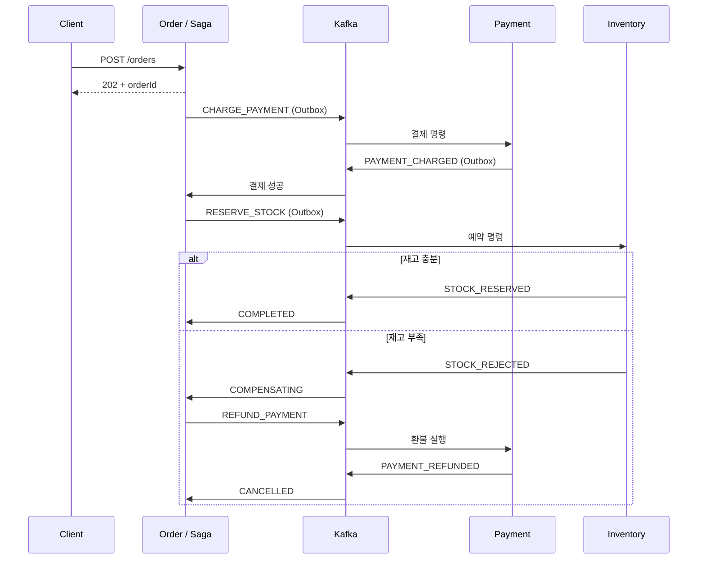

# Kafka + Spring MSA Saga 학습 예제

주문 → 결제 → 재고 예약을 서로 다른 Spring 애플리케이션으로 실행합니다. 재고가 부족하면 **이미 성공한 결제를 환불**하고 주문을 취소합니다. 주문 서비스의 `OrderSaga`가 다음 명령을 결정하는 **Orchestration Saga**입니다.

Java 21, Spring Boot 3.5.16, Spring Kafka, Spring JDBC, 서비스별 H2 DB, Kafka KRaft를 사용합니다. SQL과 트랜잭션 경계를 눈으로 확인하기 위해 JPA 대신 JDBC를 선택했습니다. Saga 프레임워크와 Lombok 없이 상태 전이를 직접 구현했습니다.

## 1. 실행하기

### Docker Compose로 전체 실행

Docker Engine/Desktop 및 Compose가 필요합니다. 프로젝트 디렉터리에서 실행하세요.

```bash
cd kafka-saga-lab
docker compose up --build -d
docker compose logs -f order-service payment-service inventory-service
```

Kafka 상태 검사 후 앱이 올라옵니다. 최초 실행은 이미지와 Maven 의존성 다운로드 때문에 시간이 걸립니다. 주문 8080, 결제 8081, 재고 8082, 호스트용 Kafka 9092 포트를 사용합니다. 서비스별 데이터와 Kafka 로그는 각각 별도 볼륨에 보관합니다.

`kafka-volume-init`은 Kafka 데이터 볼륨의 디렉터리 소유자를 실행 계정(UID/GID 1000)에 맞추고 종료합니다. 이 초기화 컨테이너의 `Exited (0)`은 정상입니다. 초기화가 성공한 뒤 Kafka가 시작되며, Kafka 자체는 기본 `appuser` 계정으로 실행됩니다. 이 단계는 새 볼륨에 로그를 기록할 때 발생할 수 있는 `AccessDeniedException`을 방지합니다.

### IDE / 로컬 Java 실행

Java 21을 준비합니다. 포함된 Maven Wrapper가 Maven을 내려받습니다(Windows는 `mvnw.cmd`). Docker에서는 Kafka만 실행하고, 앱은 IDE에서 각각의 `*Application` 클래스를 실행해도 됩니다.

```bash
docker compose up -d kafka
./mvnw clean verify
```

터미널 3개에서 **모두 프로젝트 루트**를 작업 디렉터리로 사용합니다.

```bash
java -jar order-service/target/order-service-1.0.0-exec.jar
java -jar payment-service/target/payment-service-1.0.0-exec.jar
java -jar inventory-service/target/inventory-service-1.0.0-exec.jar
```

로컬 앱은 `data/order`, `data/payment`, `data/inventory` H2 파일을 각각 사용합니다. Compose 앱과 로컬 앱을 동시에 띄우지 마세요. 동일 consumer group과 포트를 공유합니다.

## 2. curl로 세 가지 흐름 실습

최초 `book` 재고는 10개입니다. `amount`는 주문 총 결제액(정수 원)이며, `rejectPayment`는 학습용 결제 거절 스위치입니다. 실결제 API를 호출하지 않고 결제 DB 상태로 청구·환불을 모사합니다.

**정상 주문**

```bash
curl -i -X POST localhost:8080/orders \
  -H 'Content-Type: application/json' \
  -d '{"productId":"book","quantity":2,"amount":20000}'
```

HTTP `202 Accepted`와 `orderId`가 돌아옵니다. 이는 접수 성공이며 최종 완료는 아닙니다. 응답의 ID를 아래 `ORDER_ID`에 넣고 상태를 조회합니다.

```bash
curl localhost:8080/orders/ORDER_ID
curl localhost:8081/payments/ORDER_ID
curl localhost:8082/inventory/book
```

최종 주문 상태는 `COMPLETED`, 결제는 `CHARGED`, 재고는 처음부터 실습했다면 8입니다. 비동기이므로 중간 상태가 보이면 잠시 후 다시 조회하세요.

**결제 거절**

```bash
curl -X POST localhost:8080/orders \
  -H 'Content-Type: application/json' \
  -d '{"productId":"book","quantity":1,"amount":10000,"rejectPayment":true}'
```

최종 주문 `CANCELLED`, 사유 `PAYMENT_REJECTED`, 결제 `REJECTED`. 재고는 변하지 않습니다.

**결제 성공 후 재고 부족 → 보상 트랜잭션**

```bash
curl -X POST localhost:8080/orders \
  -H 'Content-Type: application/json' \
  -d '{"productId":"book","quantity":999,"amount":9990000}'
```

최종 주문 `CANCELLED`, 사유 `OUT_OF_STOCK`, 결제 `REFUNDED`. 중간에 `COMPENSATING`이 존재하며 **환불 완료 응답을 받아야 취소됩니다**. 이 시나리오에서는 재고 예약 자체가 실패했으므로 재고 해제는 필요 없습니다.

## 3. 메시지 흐름



| 현재 상태 | 받은 이벤트 | 다음 상태 | 발행 명령 |
|---|---|---|---|
| PAYMENT_PENDING | PAYMENT_CHARGED | STOCK_PENDING | RESERVE_STOCK |
| PAYMENT_PENDING | PAYMENT_REJECTED | CANCELLED | 없음 |
| STOCK_PENDING | STOCK_RESERVED | COMPLETED | 없음 |
| STOCK_PENDING | STOCK_REJECTED | COMPENSATING | REFUND_PAYMENT |
| COMPENSATING | PAYMENT_REFUNDED | CANCELLED | 없음 |

## 4. 추천 코드 읽기 순서

1. [OrderController](order-service/src/main/java/dev/study/order/OrderController.java): 비동기 주문 접수, 입력 검증, 상태 조회.
2. [OrderSaga](order-service/src/main/java/dev/study/order/OrderSaga.java): 상태 전이와 보상 명령. 가장 먼저 이해할 핵심 파일입니다.
3. [PaymentHandler](payment-service/src/main/java/dev/study/payment/PaymentHandler.java), [InventoryHandler](inventory-service/src/main/java/dev/study/inventory/InventoryHandler.java): 각각의 로컬 트랜잭션과 업무 멱등성.
4. [Outbox](common/src/main/java/dev/study/common/Outbox.java), [OutboxPublisher](common/src/main/java/dev/study/common/OutboxPublisher.java): DB 변경과 메시지 발행 사이의 장애 대응.
5. [Inbox](common/src/main/java/dev/study/common/Inbox.java), [KafkaInfrastructure](common/src/main/java/dev/study/common/KafkaInfrastructure.java): 중복 소비, 재시도, DLT.
6. [SagaIntegrationTest](integration-tests/src/test/java/dev/study/SagaIntegrationTest.java): 실행 가능한 시나리오.
7. [면접 질문과 답변](docs/interview.md): 코드와 연결하여 설명 연습.

각 서비스는 다른 서비스의 DB를 읽거나 쓰지 않습니다. `common`은 학습 편의를 위한 메시지 계약과 기술 코드 공유 모듈이며 공용 DB가 아닙니다. 각 DB에 자체 `inbox`와 `outbox` 테이블이 있습니다.

## 5. 트랜잭션과 중복 처리

소비자 처리 순서는 다음과 같습니다.

```text
Kafka 레코드 수신
  → DB 트랜잭션 시작
  → inbox 중복 확인
  → 업무 데이터 변경
  → outbox에 다음 메시지 저장
  → inbox에 처리한 eventId 저장
  → DB 커밋
  → listener 정상 반환
  → Kafka offset 커밋 (RECORD)
```

DB 커밋 후 offset 커밋 전에 종료되면 메시지가 다시 들어옵니다. 같은 DB 트랜잭션에 저장된 inbox가 재처리를 막습니다. 새로운 eventId를 가진 동일 업무 명령도 결제·예약 테이블의 `order_id` 유일 키와 현재 상태로 중복 효과를 방지합니다. 동시 insert 경합에서 유일 제약 위반이 발생하면 전체 로컬 트랜잭션이 롤백되고 메시지를 재시도합니다.

Outbox publisher는 DB에 커밋된 메시지를 Kafka로 보내고 ACK를 확인한 뒤 outbox 행을 삭제합니다. 발행 성공 후 삭제 커밋 전에 종료되면 동일 eventId로 재발행됩니다. 이 구현은 **at-least-once 전달 + 멱등한 DB 처리**입니다. Kafka producer의 `enable.idempotence`만으로 DB 변경까지 exactly-once가 되지는 않습니다. [Spring Kafka EOS 범위](https://docs.spring.io/spring-kafka/reference/3.3/kafka/exactly-once.html)

## 6. 실패 종류 구분

| 실패 | 코드의 처리 | 주문에 미치는 영향 |
|---|---|---|
| 결제 거절 / 재고 부족 | 실패 결과 이벤트 발행 | 취소 또는 보상 진행 |
| DB 일시 장애 등 기술 오류 | 예외 전파, 1초 간격 재시도 2회 | 처리 성공 시 계속 진행 |
| 소비자 재시도 소진 | 원본 토픽의 `.DLT`로 전달 | 현재 상태에서 대기, 운영자 확인 필요 |
| 잘못된 JSON / 잘못된 메시지 종류 | 재시도 없이 DLT | 정상 진행 불가 |
| Kafka 발행 장애 | outbox 유지, 다음 스케줄에 재시도 | Kafka 복구 후 재개 |

DLT 발행도 실패하면 recoverer가 예외를 던져 원본 메시지를 성공 처리하지 않습니다. **DLT 이동은 환불이나 주문 취소가 아닙니다.** 이 예제에는 자동 타임아웃·DLT 재처리 API가 없습니다. 환불 소비가 DLT로 가면 주문은 `COMPENSATING`에 머뭅니다. [Spring Kafka 오류 처리](https://docs.spring.io/spring-kafka/reference/kafka/annotation-error-handling.html)

Kafka 메시지를 직접 관찰할 수 있습니다.

```bash
docker compose exec kafka /opt/kafka/bin/kafka-console-consumer.sh \
  --bootstrap-server kafka:19092 --topic saga.replies --from-beginning \
  --property print.key=true

docker compose exec kafka /opt/kafka/bin/kafka-console-consumer.sh \
  --bootstrap-server kafka:19092 --topic payment.commands.DLT --from-beginning
```

## 7. 테스트

```bash
./mvnw verify
```

Docker 없이 Embedded Kafka(KRaft)를 실행하고, Spring 앱 3개와 서로 다른 H2 메모리 DB 3개를 띄웁니다. 최초에는 의존성 다운로드가 필요하고 로컬 포트 바인딩이 허용되어야 합니다.

검증 시나리오: 정상 완료, 결제 거절, 재고 부족 환불, 환불 소비 중단 중 COMPENSATING 유지와 재개, 동일 메시지·업무 명령 중복, 중복 환불·늦은 청구, 동시 주문 초과 판매 방지, inbox 저장 실패 시 전체 DB 롤백, 기술 오류 재시도 후 DLT, HTTP 202·조회·입력 검증.

테스트는 메시지 송신을 mock하지 않습니다. 프로세스 강제 종료나 실제 Docker 이미지 실행, 운영 DB 특성까지 검증하는 테스트는 아닙니다.

## 8. 장애 실습과 데이터 초기화

Compose로 전체 실행한 상태에서 결제 서비스 정지를 실습합니다.

```bash
docker compose stop payment-service
# POST /orders 실행 → PAYMENT_PENDING 유지
docker compose start payment-service
# 같은 주문 조회 → 소비 재개 후 최종 상태로 진행
```

`docker compose down`은 실행만 종료하고 데이터를 보관합니다. 처음부터 실습하려면 **이 예제의 모든 주문·결제·재고·Kafka 데이터를 삭제하는** 아래 명령을 실행합니다.

```bash
docker compose down -v
```

로컬 Java 방식의 H2 파일은 Compose 볼륨과 별개입니다. 로컬 데이터 초기화는 앱 3개를 모두 종료한 후 프로젝트의 `data/` 디렉터리를 삭제합니다. Kafka만 초기화하거나 DB만 초기화하면 이벤트와 상태가 불일치하므로 함께 초기화하세요.

## 9. 학습 범위와 실무 확장

- 서비스당 인스턴스 1개와 파일 H2 DB를 전제로 합니다. 여러 replica로 늘리려면 서비스별 공유 운영 DB, outbox 작업 선점/lease, 주문별 발행 순서를 함께 설계해야 합니다. 단순 `SKIP LOCKED`만으로 같은 주문의 발행 순서가 자동 보장되지는 않습니다.
- Publisher는 한 건씩 동기 송신하며 DB 잠금을 유지합니다. 흐름을 드러내기 위한 구현입니다. 처리량·대기 시간·DB 자원 측정 후 배치 relay나 CDC 방식 등을 검토할 수 있습니다.
- 금액과 결제 거절 여부를 요청으로 받는 것은 실습 편의입니다. 운영에서는 서버의 상품 가격·주문 스냅샷으로 계산하고 실제 PG에 결제/환불 멱등 키, 결과 조회와 대사를 적용해야 합니다.
- POST 자체의 idempotency key는 구현하지 않았습니다. 같은 HTTP 요청을 두 번 보내면 서로 다른 주문 두 개가 생깁니다.
- 단일 메시지 record를 공유합니다. 운영에서는 명령/이벤트별 버전과 스키마 호환성을 관리하고 주문 원장과 응답 데이터의 일치 여부를 검증해야 합니다. 상태 전이는 정상 생산자의 인과 순서를 전제로 합니다.
- 중복/지난 단계 응답은 현재 상태를 되돌리지 않습니다. 신뢰할 수 없는 생산자, 미래 단계 이벤트, 타임아웃 후 늦은 성공을 다루려면 단계 번호와 명시적 전이 검증·복구 정책을 추가해야 합니다.
- 자동 Saga 타임아웃, 보상 실패 복구, DLT 승인 재처리, 외부 결제 대사, 관측 지표와 알림은 후속 학습 과제입니다. 장애가 영구적이면 최종 일관성도 저절로 달성되지 않습니다.
- Kafka 토픽은 3 partition, replication factor 1인 로컬 실습 구성입니다. `acks=all`도 브로커 1대의 디스크 손실까지 막지는 못합니다. 인증·인가와 운영 배포 구성은 포함하지 않았습니다.

Saga는 이미 커밋된 로컬 트랜잭션을 새 보상 트랜잭션으로 정리합니다. Outbox는 로컬 데이터와 발행 의도를 함께 기록합니다. 두 패턴은 서로 다른 문제를 다룹니다. [Saga 패턴](https://microservices.io/patterns/data/saga.html), [Transactional Outbox 패턴](https://microservices.io/patterns/data/transactional-outbox.html)
