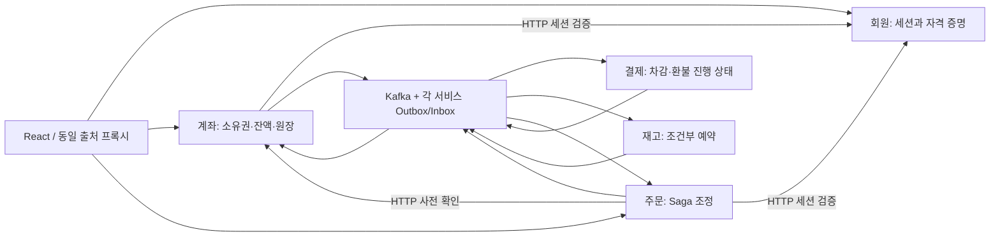

# 기술면접을 위한 학습 경로

이 프로젝트의 목적은 기능 수가 아니라 **문제 → 불변식 → 선택 → 실패 시나리오 → 검증 → 한계**를 코드로 설명하는 것입니다. [전체 파일 안내](file-guide.md)에서 구현 파일로 이동하고, 해당 파일의 `학습` 주석과 핵심 분기 주석을 읽으세요. [면접 질문](interview.md)은 답을 외우기보다 아래 실험 후 자신의 표현으로 답하는 용도입니다.

## 1. 기능을 학습 주제로 재분류하기

| 학습 주제 | 관찰할 기능 | 설명할 설계 선택 | 검증 근거 |
|---|---|---|---|
| 인증과 인가 | 가입·로그인·내 정보·본인 계좌 | 비밀번호 KDF, 영속 세션, 소유권 WHERE | `membersAuthenticateUpdateAndRevokeSessions`, `accountOwnershipIdempotencyAndConcurrentWithdrawals` |
| 동시성 제어 | 입출금·계좌 해지·재고 예약 | 행 잠금 vs 조건부 UPDATE, DB 제약, 공통 잠금 순서 | `conditionalStockUpdateSurvivesActualDatabaseContention`, 동시 출금 테스트 |
| 경계별 검증 | HTTP·Bean 직접 호출·Kafka | DTO 형식 검증과 업무 불변식, 원장 대조의 차이 | `accountRulesProtectNonHttpCallers`, 계좌 Handler의 원장 검사 |
| 비동기 계약 | 주문 접수와 결과 조회 | HTTP 202, 폴링, 조회 스냅샷, 응답 유실 | 브라우저 주문·응답 유실 테스트 |
| 분산 트랜잭션 | 계좌 차감 후 재고 부족 | 로컬 트랜잭션 + Orchestration Saga, 명시적 보상 | `ordersDebitRefundAndRejectWithoutLeakingOtherMembersData` |
| 신뢰성 있는 전달 | 업무 DB와 Kafka 발행 | Outbox, Inbox, at-least-once, 업무 멱등성 | `inboxFailureRollsBackStockReservationAndOutbox`, 중복 명령 테스트 |
| 장애와 복구 | 소비 중단·재시도 소진·재개 | 업무 거절 vs 기술 실패, DLT의 한계 | `exhaustedTechnicalFailureGoesToDlt`, 환불 소비 중단 테스트 |
| 실행과 증거 | Compose/K8s·통합·브라우저 테스트 | 데이터 수명, 준비 상태, 테스트 격리 | `./mvnw verify`, `npm test`, 설정 렌더링 |

별칭 수정 같은 CRUD 자체가 높은 난도의 면접 주제는 아닙니다. 여기서는 소유권 검사, 해지와의 경쟁, 읽기/쓰기 API 경계를 연습하는 **보조 기능**입니다. CSS와 빌드 파일은 분산 알고리즘이 아니라 접근성·배포 재현성을 배우는 지원 코드입니다. 모든 파일이 같은 난도의 알고리즘을 담아야 하는 것은 아닙니다.

## 2. 먼저 이해할 서비스 경계



- 회원과 계좌는 인증 정보와 금전 상태의 책임/저장소를 분리합니다. 비용은 HTTP 인증 확인에 따른 지연·장애 전파입니다.
- 주문은 언제 다음 단계를 실행할지 결정하고, 계좌/재고는 자기 자원의 규칙만 실행합니다.
- 결제 서비스는 외부 작업의 요청과 확정을 분리하는 상태 머신을 보여줍니다. 단일 가상 계좌 결제만 필요하다면 계좌 서비스와 합칠 수도 있습니다. 교육상 경계 비용과 향후 외부 PG 교체를 비교하기 위해 분리했습니다.
- 회원은 Kafka를 사용하지 않습니다. MSA라는 이유만으로 모든 CRUD를 메시지로 바꾸지 않습니다.
- 공통 모듈은 메시지/전달 기술을 공유합니다. 다른 서비스의 DB나 업무 엔티티를 공유하지 않습니다. 공유 코드도 서비스 버전을 묶는 결합이라는 한계가 있습니다.

## 3. 읽고 실험하는 순서

### 단계 A — 인증했다고 모든 자원에 접근할 수 있는가?

`MemberController → MemberService → Passwords → MemberSessions → AccountController → AccountService.owned` 순서로 읽습니다.

두 회원을 만들고, 첫 회원의 계좌 ID를 두 번째 회원 세션으로 조회·수정해 보세요. 예상 결과는 404이며, 로그인하지 않은 요청은 401입니다. UUID의 추측 난이도와 접근 권한은 다릅니다. 비밀번호 변경 후 기존 쿠키도 사용할 수 없어야 합니다.

**이번에 보완한 경쟁 조건:** 로그인은 비밀번호를 확인한 뒤 세션을 저장합니다. 이 사이에 다른 트랜잭션이 비밀번호 변경과 세션 전체 삭제를 마치면, 예전 비밀번호로 새 세션이 살아남을 수 있습니다. 로그인과 비밀번호 변경이 동일 회원 행을 잠그도록 바꿨습니다. `loginWaitsForCredentialChangeAndRejectsOldPassword`가 변경 트랜잭션을 명시적으로 열어 이 경합을 재현합니다. 비용은 KDF를 계산하는 동안 잠금을 점유한다는 것입니다. 자격 증명 버전 CAS가 대안입니다.

### 단계 B — DB 트랜잭션만 붙이면 동시성이 해결되는가?

`AccountRules → AccountService.transact → AccountOrderHandler → InventoryHandler`를 비교합니다.

- 단순 재고 규칙은 `available >= quantity` 조건부 UPDATE로 한 번에 판단·차감합니다.
- 계좌는 잔액뿐 아니라 해지 상태, 기존 요청, 환불 가능액, 거래 원장을 함께 검사하므로 행 잠금을 잡고 판단합니다.
- 모든 계좌 변경 경로가 같은 계좌 행부터 잠가야 합니다. 다른 API에서 잠금 규약을 무시하면 이 보장이 깨집니다.
- `@Valid`는 HTTP 입력 형식을 검사합니다. Bean 직접 호출이나 Kafka에는 적용되지 않으므로 금액/종류/요청 ID를 `AccountRules`에서도 방어합니다. DB의 CHECK/UNIQUE는 별도의 마지막 방어입니다.

**증거 구분:** `concurrentOrdersNeverOversell`은 동시 주문의 E2E 결과입니다. 현재 소비자 concurrency가 1이므로 재고 DB 경쟁을 직접 입증하지는 않습니다. 새 `conditionalStockUpdateSurvivesActualDatabaseContention`은 6개의 독립 트랜잭션을 같은 출발 장벽에서 시작시켜 재고 10개에 3개씩 요청하고, 3건 성공/3건 거절/잔고 1을 확인합니다.

### 단계 C — 접수와 완료는 어떤 차이가 있는가?

`OrderController → OrderSaga.create → Outbox → OutboxPublisher → Listener → Handler`를 따라갑니다. `frontend/src/hooks/useOrderObservation.js`는 이 프로토콜을 화면에서 관찰합니다.

결제 서비스를 멈추고 주문하면 HTTP 202가 반환되어도 `PAYMENT_PENDING`으로 남습니다. 재개 후 진행됩니다. HTTP 타임아웃은 클라이언트가 응답을 받지 못했다는 뜻이며 서버 작업의 실패/rollback 증거가 아닙니다. 프론트엔드는 POST를 자동 재전송하지 않습니다.

### 단계 D — 보상도 실패하면 무슨 상태가 남는가?

충분한 금액을 입금한 뒤 수량 999로 재고 부족 주문을 만듭니다. 계좌 차감 → 재고 거절 → `COMPENSATING` → 계좌 환불 → `CANCELLED`를 따라갑니다. 빠른 중간 상태는 폴링에서 보이지 않을 수 있으며 거래 원장과 DB를 함께 확인해야 합니다.

`AccountOrderHandler`의 `DEBITED`는 환불 가능한 차감입니다. 잔액을 0으로 만들었어도 이 상태가 있으면 해지할 수 없습니다. 정상 주문의 `SETTLE_ACCOUNT`를 처리해야 확정됩니다. 환불 공간을 미리 예약하지 않으면 그 사이 입금으로 잔액 상한에 도달해 보상이 실패할 수도 있습니다.

### 단계 E — 메시지 중복과 요청 중복은 같은가?

| 식별자 | 역할 | 저장소 |
|---|---|---|
| `eventId` | 동일 Kafka 메시지 재전달 | Inbox PK |
| `orderId` | 새 메시지 ID로 다시 온 동일 주문 업무 | 주문별 결제·예약·계좌 원장 |
| `requestId` | 동일 계좌 입출금 API 재요청 | `(account_id, request_id)` 유일 키 |
| 주문 생성 API의 멱등 키 | 현재 미구현 | 별도 확장 필요 |

Outbox relay가 ACK 뒤 삭제 커밋 전에 종료되면 중복 발행됩니다. Inbox 조회만으로는 동시 중복을 막지 못하며 PK와 업무 트랜잭션 rollback이 함께 필요합니다. 새 eventId의 동일 업무는 Inbox를 통과하므로 업무 원장도 있어야 합니다.

### 단계 F — 테스트가 실제로 보장하는 것은 어디까지인가?

```bash
python3 scripts/check-learning-docs.py
./mvnw verify
cd frontend
npm ci
npm run build
npx playwright install chromium
npm test
```

주석 검사 도구는 설명의 존재/파일 안내 누락만 검사합니다. 올바른 주장인지는 시나리오와 코드 리뷰로 확인해야 합니다. 실제 Kafka 통합 테스트도 프로세스 강제 종료, 디스크 손실, 네트워크 분단이나 PostgreSQL의 격리 수준까지 입증하지 않습니다. 브라우저 테스트의 일부 오류 케이스만 네트워크 차단을 사용하고, 정상 결제·환불은 실제 서비스로 확인합니다.

## 4. 이번 구조 정리의 이유

- `AccountRules`: HTTP 입력 검증과 업무 불변식의 차이를 코드 경계로 표현했습니다. 현재 규모에서 SQL을 감추는 범용 Repository나 불필요한 인터페이스는 추가하지 않았습니다.
- `main.jsx / App.jsx / useOrderObservation.js`: DOM 진입점, 화면 조합, 비동기 관찰 수명을 분리했습니다. effect cleanup과 상태 경쟁을 한 파일에서 집중해 읽을 수 있습니다.
- 주문 INSERT에 소유권을 함께 저장: 바로 뒤 UPDATE를 없애 DB 왕복을 줄였습니다. 기능을 위한 것이 아닌 불필요한 쿼리를 줄이는 작은 리팩터링입니다.
- 기존 `PaymentHandler`의 계좌 없는 경로: 과거 메시지/기초 테스트 호환이라는 이유를 주석에 명시했습니다. 현재 사용자 기능은 `AccountPaymentHandler`입니다. 호환 코드 제거는 과거 데이터 정책과 함께 해야 합니다.
- 실행 파일·SQL·UI·테스트에도 주석을 추가했습니다. JSON과 Maven Wrapper 원본은 형식/생성 파일 특성상 주석을 넣지 않고 [파일 안내](file-guide.md)에 역할과 제외 이유를 기록했습니다.

## 5. 추가하면 면접에서 가치가 큰 기능 — 우선순위와 완료 기준

| 우선순위 | 추천 과제 | 배울 질문 | 완료를 입증할 테스트 |
|---|---|---|---|
| 1 | 주문 생성 `Idempotency-Key` + 요청 결과 저장 | 응답을 잃었을 때 새 주문 생성 없이 어떻게 복구하는가? | 같은 회원/키 동시 10회 → 주문 1개, 다른 본문 재사용 → 409, 응답 유실 후 같은 결과 |
| 2 | 서비스별 PostgreSQL + Testcontainers | H2에서 성공한 잠금/격리 가정이 운영 DB에서도 성립하는가? | 실제 행 경합, deadlock/serialization failure 전체 트랜잭션 재시도, 스키마 마이그레이션 |
| 3 | Saga 체류 시간·Outbox 나이·DLT 관측 | 정상적인 지연과 복구가 필요한 고착을 어떻게 구분하는가? | 소비 중단 시 지표 증가, 복구 후 감소, 미완료 주문을 완료로 오표시하지 않음 |
| 4 | 승인 가능한 DLT 재처리·대사 | 중복된 재처리가 돈을 다시 움직이지 않음을 어떻게 보장하는가? | 기존 eventId 재처리, 새로운 이벤트의 업무 멱등성, 상태/원장 불일치 탐지 |
| 5 | 계좌 간 이체 | 두 행 잠금 순서와 교착·원자성은 어떻게 설계하는가? | A→B와 B→A 동시 이체, 총액 보존, 중간 실패 시 양쪽 rollback |
| 6 | 비밀번호 저장 형식 버전·KDF 점진 갱신·로그인 요청 제한 | 비용 인자를 높여도 기존 사용자가 로그인할 수 있는가? | 구형 해시 로그인 후 갱신, 잘못된 비밀번호로는 갱신 안 됨, 제한 정책 검증 |
| 7 | 서비스/메시지 인증·계약 버전 | Kafka 필드에 memberId가 있다고 신뢰할 수 있는가? | 허용되지 않은 생산자 차단, 이전/새 버전 소비, 누락 필드와 원장 불일치 구분 |

**일부러 한꺼번에 추가하지 않은 것:** Redis 분산 락, JWT, CQRS, 이벤트 소싱, 복잡한 DDD 계층은 이름 자체가 학습 목표가 아닙니다. 현재 제약을 해결할 필요와 비교 실험이 생길 때 도입하세요. 현재 거래 원장+잔액 테이블은 이벤트 소싱 구현이 아닙니다.

## 근거 문서

주석은 현재 코드가 실제로 보장하는 범위를 기준으로 작성했습니다. 외부 개념을 더 확인할 때는 [Spring 트랜잭션 프록시/self-invocation](https://docs.spring.io/spring/reference/6.2/data-access/transaction/declarative/annotations.html), [OWASP 비밀번호 저장](https://cheatsheetseries.owasp.org/cheatsheets/Password_Storage_Cheat_Sheet.html), [Kafka 전달 의미](https://kafka.apache.org/41/design/design/)를 참고하세요. 보안 비용 인자와 운영 환경 선택은 고정된 정답이 아니라 요구사항·성능 측정과 함께 결정합니다.
